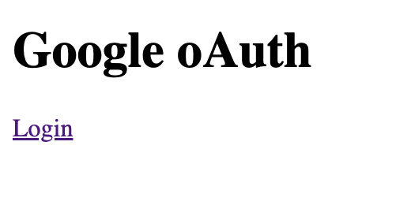
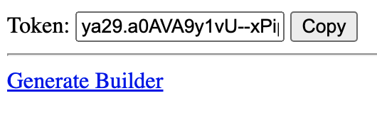
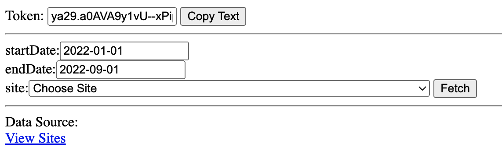

# cf-gsc
Cloudflare Worker for Google Search Console

# Why
Showcase how you could build a simple cloudflare worker to download GSC data from their API using oAuth. Ideally you could set this up to send the data to BigQuery on a [https://developers.cloudflare.com/workers/platform/cron-triggers/](cron), but I will let you do that integration or save it for another day 🤔

# Code
This codebase leverages [https://github.com/kwhitley/itty-router](https://github.com/kwhitley/itty-router) to simplify and make it easier to read/refactor. 

* index.js - main routes file
* handlers/auth.js - oauth for Google
* handlers/builder.js - UI for downloading GSC data w/access token
* handlers/homepage.js - Login to Google via oAuth
* handlers/query.js - GSC API Wrapper for downloading data
* handlers/sites.js - GSC API wrapper for showing sites you have connected in GSC

# Demo
### Homepage

### Auth

### Builder UI

# Set up
You will need to setup an API key via [https://console.cloud.google.com/apis/credentials?project=XXXX](Google)

# Thanks
This repo was sparked from this [https://twitter.com/DataChaz/status/1565432139197325315](twitter thread), 
so special thanks to the following:
* Charly Wargnier [https://twitter.com/DataChaz](@DataChaz)
* Greg Bernhardt [https://twitter.com/GregBernhardt4](@GregBernhardt4)
* JC Chouinard [https://twitter.com/ChouinardJC](@ChouinardJC)
